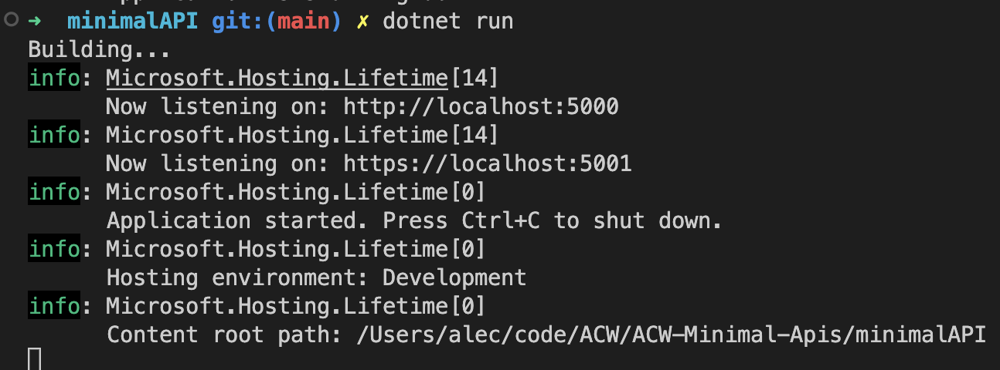

## Goal Of this ACW?
The goal of this ACW is to fully investigate minimal apis using .Net 7. 

### Scenario  
To keep this app festive we are going to build a sample API for Santa and his elves. So this will be a simple list of children that can be checked twice (only by Santa of course), and will have list of toys that the elves can view and build. So we will have some data with some relationships. By the end of this project we want an API that an elevated admin (Santa) can view and "double check" the child as good or naughty, and if they are good then an elf can read the child and their wishlist to be able to construct the toys. The elf role can edit toys and mark when they've been built, but they can't view naughty kids and can't mark any kid nice. 

### Project Setup
The first thing that is required is to have .Net 7+ that can be found [here](https://dotnet.microsoft.com/en-us/download/dotnet).

To start our project we are going to want to run this command. It will init a fairly empty .Net project.


``` bash
dotnet new web -o minimalAPI
````

If this is the first time you are running a .Net app or you should first run this command 
``` bash
dotnet dev-certs https --trust
```

Now for this project we are also going to want to use EF core so go ahead and install that and the in-memory DB version of it! We're also going to be lazy and add swagger so we don't need a tool like postman to test our APIs (that's the last dependency)
``` bash 
dotnet add package Microsoft.EntityFrameworkCore.InMemory
dotnet add package Microsoft.AspNetCore.Diagnostics.EntityFrameworkCore
dotnet add package Swashbuckle.AspNetCore
dotnet add package Microsoft.AspNetCore.Authentication.JwtBearer
dotnet add package Microsoft.NET.Build.Containers
```

Now if we look at our file we have an API!
``` cs
var builder = WebApplication.CreateBuilder(args);
// This line is creating the web application itself
var app = builder.Build();
// This line is instantiating the app

app.MapGet("/", () => "Hello World!");
// This line is declaring a HTTP GET route at the root that 
// will return the string hello world

app.Run();
// This line is making sure the app runs and continues running
```

This is a simple API that will just allow us to run and get to creating! 

Now we can run our app with 
``` bash
dotnet run
```
This will run our simple API on a single port and we can click the link and see hello world for me that link is http://localhost:5224/ but check your console in case. Now, this behavior is different than most .Net apps. Most applications have 2 URLs and ports. Typically an http AND a https option. How do we do that? In minimum APIs it's simple we just define our ports!

On the line before we declare our first route we just want to add these two lines
``` cs
app.Urls.Add("http://localhost:5000");
app.Urls.Add("https://localhost:5001");
``` 
we now have our two URLS! 


Now lets setup swagger so we can have a nice GUI to run on test requests through!

First we need to add our first using statement
``` cs
using Microsoft.OpenApi.Models;
```

Towards the start under var builder we want to throw this in 
``` cs
builder.Services.AddEndpointsApiExplorer();
builder.Services.AddSwaggerGen(c =>
{
     c.SwaggerDoc("v1", new OpenApiInfo {
         Title = "Santa API",
         Description = "Making sure every good kid gets a gift",
         Version = "v1" });
});
// This setups up our swagger info
```

Now right after the var app section we want this 
``` cs
app.UseSwagger();
app.UseSwaggerUI(c =>
{
   c.SwaggerEndpoint("/swagger/v1/swagger.json", "Santa API V1");
});
// Now we are telling the app to use swagger and the URL that it is at
```

Now if you did everything right our API swagger tester should be live at https://localhost:5001/swagger/index.html

So in summary of the setup we now have a simple hello world api with swagger running. Lets get to building our endpoints! 

### Logic Creation 
So there are a couple of ways you could go about doing creating this application. My security friends will cringe, but since I know this won't be deployed until everything is configured correctly I am going to promise to come back to security. 

So I think we want a few data models to start with we want a child and that model will have a sub list of gifts they want. So lets start with defining a gift.

This data model is going to look like this
``` json
gift : {
    Name: string,
    shouldBeBuilt: bool,
    startedBuilding: bool,
    isCompleted: bool,
}
```
Our child object will look something like this
``` json
child: {
    Name: string,
    isGood: bool,
    checkedTwice: bool,
    wantedItem: gift,
    presentReadyForDelivery: bool
}
```

So lets create these models. There are two different ways we can create this in EF. There are owned entity types so that our child table could house our gift table. However, there are limitations that typically rule that out for most projects. For example not being able to create a DbSet T, Entity T () cannot be called on model builder, or finally owned entities have a strange relationship with inheritance. You might ask yourself why do I care? Well a typical tool used in most if not all .Net projects I've used is Specflow a very common testing tool. That tool is designed to be used to create sets and to map models from a UI table to the entity in EF Core. That because really difficult when technically a child object is in the same table as the parent, but doesn't seed very easily in Specflow due to your entity not matching the exact table definition. Thus, I would reccomend the other solution which is foreign keys.

Now we want to create our two cs files Child.cs and Gifts.cs
``` cs 
namespace minimalAPI.Models 
{
    public class Child
    {
          public int Id { get; set; }
          public string Name { get; set; }
          public bool IsGood { get; set; }
          public bool checkedTwice { get; set; }
          public Gift wantedItem { get; set; }
          public bool presentReadyForDelivery { get; set; }
    }
}
```
``` cs
namespace minimalAPI.Models 
{
    public class Gift
    {
          public int Id { get; set; }
          public string Name { get; set; }
          public bool shouldBeBuilt { get; set; }
          public bool startedBuilding { get; set; }
          public bool isCompleted { get; set; }
    }
}
```
respectively. 

Now after that we need to implement our context. As shown above we are going to use an in memory DB to not overly complicate this.

That file will look like this 
``` cs
using minimalAPI.Models;
using Microsoft.EntityFrameworkCore;

class SantaDbContext : DbContext
{
     public SantaDbContext(DbContextOptions<SantaDbContext> options)
            : base(options)
        {
        }

    public DbSet<Child> Children { get; set; } = null!;
    public DbSet<Gift> Gifts { get; set; } = null!;
}
```
Finally, we are going to add this to our program.cs file
``` cs
builder.Services.AddDbContext<SantaDbContext>(options => options.UseInMemoryDatabase("items"));
```
Now our items should be persistent while the app is running.

So our first endpoint will be a POST to create a child with a gift for Santa to use moving forward, next we need a GET All so Santa can review his list, then we are going to create a PUT for him to update the child once Santa has checked his list twice, a GET for the elves to get all gifts ready to be build, PUT to update toys that in progress and finally a PUT to finish a toy and mark the gift ready to be delivered. 

First we'll look at all of the Santa endpoints 
``` cs
// Lock down to Santa
app.MapPost("/Child", async (SantaDbContext db, Child child) => {
    // Add child to db object
    await db.Children.AddAsync(child);
    // Commit change
    await db.SaveChangesAsync();
    // Return created
    return TypedResults.Created($"{child.Id}", child);
});

app.MapGet("/Child", async (SantaDbContext db) => await db.Children.Include(x => x.wantedItem).ToListAsync());

// Lock down to Santa
app.MapPut("/Child", async (SantaDbContext db, bool isGood, int id) => {
    // Find the right child
    var child = await db.Children.Where(x => x.Id == id).Include(x => x.wantedItem).FirstOrDefaultAsync();
    // If the ID doesn't exist throw not found
    if (child is null) return Results.NotFound();
    
    // If the child is good and good again we can assume they are being checked twice
    if (child.IsGood && isGood){
        child.checkedTwice = true;
        child.wantedItem.shouldBeBuilt = true;
    } else {
        // If child was not previously good or isGood is false update child.IsGood
        child.IsGood = isGood;
    }

    // Whatever we change update it
    await db.SaveChangesAsync();
    // Return http code
    return Results.NoContent();
});
```
Next it is for the elves! 
``` cs
app.MapGet("/Gift/NeedingBuilt", async (SantaDbContext db) => await db.Gifts.Where(x => x.shouldBeBuilt && !x.startedBuilding).ToListAsync());
app.MapPut("/Gift/StartedBuilding/{id}", async (int id, SantaDbContext db) => {
    var giftToUpdate = await db.Gifts.FindAsync(id);

    if (giftToUpdate is null) return Results.NotFound();

    giftToUpdate.startedBuilding = true;

    await db.SaveChangesAsync();
    return Results.NoContent();
});

app.MapPut("/Gift/Finished/{id}", async (int id, SantaDbContext db) => {
    var giftToUpdate = await db.Gifts.FindAsync(id);

    if (giftToUpdate is null) return Results.NotFound();

    var childToUpdate = await db.Children.Include(x => x.wantedItem).FirstOrDefaultAsync(x => x.wantedItem.Id == id);

    if (childToUpdate is null) return Results.NotFound();

    giftToUpdate.isCompleted = true;
    childToUpdate.presentReadyForDelivery = true;

    await db.SaveChangesAsync();
    return Results.NoContent();
});
```
Now our api alone is setup. Santa can setup a child to monitor, deem him good, have an elf see that the toy is ready to be built, a few different statuses to show where the gift is in the process, and finally ready to delivery. Now we are here what's next? Well, what if we get a disgruntled child, what if we get an elf that wants to override Santa, or what even Santa wants to overwrite what the elves are doing? If you are in security or reporting role you are cringing on all of the ways our simple API could be taken advantage of, so in order to stop that lets establish some roles at a minimum so we know who is hitting our API and determine their eligibility to do so.

### Authentication and Authorization

The first thing we need to do is start to lock down our program.cs it will look like adding these two lines above our var app section
``` cs
builder.Services.AddAuthentication().AddJwtBearer();
builder.Services.AddAuthorization();
```
and before app.run we want to add the following code 
``` cs
builder.Services.AddCors();
builder.Services.AddAuthentication().AddJwtBearer();
builder.Services.AddAuthorization(options =>
{
    options.AddPolicy("RequireSantaRole",
        policy => policy.RequireRole("SantaRole"));
    options.AddPolicy("RequireElfRole",
        policy => policy.RequireRole("ElfRole"));
});
```
Finally we need to add the correct role to the correct endpoints like the following:
``` cs
    .RequireAuthorization("RequireSantaRole");
    // OR 
    .RequireAuthorization("RequireElfRole");
```
Now that we have that in place we can actually use CLI commands to test our stuff! That's something new I found out when running through this personally. So with the following command we can generate a JWT token and then set a specific role and scope!
``` bash
dotnet user-jwts create --scope "greetings_api" --role "SantaRole"
```
This will dump out a JWT token that will have our Santa role and throw an error if we use it to hit an elf end point! Then to use the token we can also use the API like so 
``` bash
curl -i -H "Authorization: Bearer {token}" https://localhost:{port}/hello
```
Now we should get a 200 from our API! We can also use the JWT token in Swagger to use swagger to hit our endpoints moving forward if we'd like!

### Deploy to Azure
Now that we have this built we want to get it to Santa. In terms of the holiday season load can be huge! However, once everyone gets their gifts demand on this API will be zero or close to zero. Due to that we are going to containerize our app so it can easily go to any cloud and we are going to use Azure Container Apps to get a lot of the benefits of Azure Kubernetes Service without having to manage a whole cluster. We are going to login into our Azure subscription (create one if you haven't), make sure we have the latest version of the CLI, add the container app extension. We are then going to get everything in the cloud ready for cloud builds so we don't have to run this locally and then we are going to publish our image. 

We want to configure Kestrel to make sure the app works as expected locally add this to you app settings
``` json
"Kestrel": {
    "Endpoints": {
      "Http": {
        "Url": "http://*:5000"
      },
      "Https": {
        "Url": "https://*:5001"
      }
    }
  }
  ```

``` bash
az upgrade
az extension add --name containerapp --upgrade
az provider register --namespace Microsoft.App
az provider register --namespace Microsoft.OperationalInsights

dotnet dev-certs https -ep $env:USERPROFILE\.aspnet\https\aspnetapp.pfx -p crypticpassword
dotnet dev-certs https --trust
# Declares variables
RESOURCE_GROUP=acwdotnetug
LOCATION=CentralUS
ACR_NAME=mytestacrwalkthrough
API_NAME=minimalapi
ENVIRONMENT=containerAppEnvName

# Creates resource group
az group create \
  --name $RESOURCE_GROUP \
  --location "$LOCATION"

# Creates Azure container registry
az acr create \
  --resource-group $RESOURCE_GROUP \
  --name $ACR_NAME \
  --sku Basic \
  --admin-enabled true

# Create container app env
az containerapp env create \
  --name $ENVIRONMENT \
  --resource-group $RESOURCE_GROUP \
  --location "$LOCATION" \
  --internal-only false

# Deploy image to container app env
az containerapp compose create -g $RESOURCE_GROUP --environment $ENVIRONMENT --compose-file-path "docker-compose.yml"
```
Now we have a deployed ACA container and can hit it anywhere in the world!


# References  
- https://learn.microsoft.com/en-us/aspnet/core/fundamentals/minimal-apis?view=aspnetcore-7.0 
